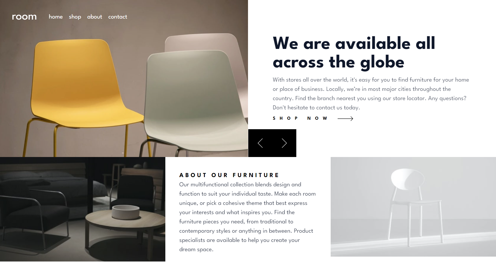
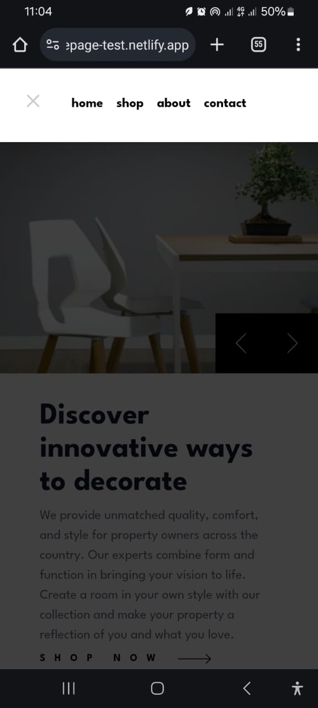

# Frontend Mentor - Room Homepage Solution

This is a solution to the [Room homepage challenge on Frontend Mentor](https://www.frontendmentor.io/challenges/room-homepage-BtdBY_ENq). Frontend Mentor challenges help you improve your coding skills by building realistic projects.

## Table of contents

- [Overview](#overview)
  - [The challenge](#the-challenge)
  - [Screenshot](#screenshot)
  - [Links](#links)
- [My process](#my-process)
  - [Built with](#built-with)
  - [What I learned](#what-i-learned)
  - [Continued development](#continued-development)
  - [Useful resources](#useful-resources)
- [Author](#author)
- [Acknowledgments](#acknowledgments)

## Overview

### The challenge

Users should be able to:

- View the optimal layout for the site depending on their device's screen size
- See hover states for all interactive elements on the page
- Navigate the slider using either their mouse/trackpad or keyboard

### Screenshot








### Links

- Solution URL: [GitHub Repository](https://github.com/YUSSIF62/room-homepage-test)
- Live Site URL: [Room Homepage Live](https://room-homepage-test.netlify.app/)

## My process

### Built with

- Semantic HTML5 markup
- CSS custom properties
- Flexbox
- CSS Grid
- Mobile-first workflow
- [React](https://reactjs.org/) - JS library
- [TypeScript](https://www.typescriptlang.org/) - For type safety
- [Styled Components](https://styled-components.com/) - For styles
- [Tailwind CSS](https://tailwindcss.com/) - For utility-first CSS framework
- [Netlify](https://www.netlify.com/) - For deployment

### What I learned

Working on this project allowed me to deepen my understanding of several key technologies and concepts. Here are some highlights:

#### React Components

Creating reusable and functional components in React was a significant part of this project. Here is an example of a component that manages the header with a responsive navigation menu:

```tsx
import React, { useState } from "react";
import logo from "../images/logo.svg";
import menu from "../images/icon-hamburger.svg";
import close from "../images/icon-close.svg";

const Header: React.FC = () => {
  const [isOpen, setIsOpen] = useState(false);

  return (
    <header className="absolute z-10 flex items-center justify-center w-full p-8 lg:items-center lg:justify-start">
      <div>
        
      </div>
      <div className={`${isOpen ? "bg-black bg-opacity-75 absolute top-0 left-0 right-0 bottom-0 h-screen" : "bg-transparent"} lg:bg-transparent lg:h-auto lg:relative`}>
        <nav className={`${isOpen ? "open w-full py-8 lg:py-0 lg:w-auto" : ""}`}>
          <ul className="flex flex-wrap items-center justify-center gap-4 font-bold lg:font-normal">
            <li>
              <button className="transition-all duration-200 border-b-2 border-transparent hover:border-neutral-900 lg:text-white lg:hover:border-b-white">
                home
              </button>
            </li>
            <li>
              <button className="transition-all duration-200 border-b-2 border-transparent hover:border-neutral-900 lg:text-white lg:hover:border-b-white">
                shop
              </button>
            </li>
            <li>
              <button className="transition-all duration-200 border-b-2 border-transparent hover:border-neutral-900 lg:text-white lg:hover:border-b-white">
                about
              </button>
            </li>
            <li>
              <button className="transition-all duration-200 border-b-2 border-transparent hover:border-neutral-900 lg:text-white lg:hover:border-b-white">
                contact
              </button>
            </li>
          </ul>
        </nav>
      </div>
      <div className="absolute z-20 left-8 top-8 lg:hidden">
        {isOpen ? (
          <button onClick={() => setIsOpen(false)}>
            
          </button>
        ) : (
          <button onClick={() => setIsOpen(true)}>
            
          </button>
        )}
      </div>
    </header>
  );
};

export default Header;
```

#### Responsive Design

Using CSS Grid and Flexbox allowed me to create a responsive layout that adapts to different screen sizes. Here's a snippet showing how I used CSS Grid:

```css
.section {
  display: grid;
  grid-template-columns: 1fr;
}

@media (min-width: 1024px) {
  .section {
    grid-template-columns: repeat(3, 1fr);
  }
}
```

#### State Management

Handling state in a functional React component to manage a slideshow was an interesting challenge. Here's a simplified example:

```tsx
const Showcase: React.FC = () => {
  const [slideIndex, setSlideIndex] = useState<number>(1);

  function nextSlide() {
    setSlideIndex((prevIndex) => (prevIndex !== data.length ? prevIndex + 1 : 1));
  }

  function previousSlide() {
    setSlideIndex((prevIndex) => (prevIndex !== 1 ? prevIndex - 1 : data.length));
  }

  return (
    <section>
      {data.map((item, index) => (
        <article key={item.id} className={slideIndex === index + 1 ? "grid grid-cols-1 lg:grid-cols-2 lg:place-items-center" : "hidden"}>
          
          <div className="relative p-8 lg:p-12">
            <h1 className="px-4 text-4xl font-bold text-slate-900 lg:text-5xl">{item.title}</h1>
            <p className="px-4 my-2 opacity-65 text-slate-900">{item.desc}</p>
          </div>
        </article>
      ))}
    </section>
  );
};

export default Showcase;
```

### Continued development

In future projects, I plan to:

- Further explore advanced state management techniques, such as using Redux or Context API for more complex applications.
- Improve my skills in animations and transitions to create more interactive and engaging user interfaces.
- Deepen my understanding of accessibility best practices to ensure all my projects are usable by as many people as possible.

### Useful resources

- [React Documentation](https://reactjs.org/docs/getting-started.html) - This is an excellent resource for understanding React and its ecosystem.
- [Styled Components Documentation](https://styled-components.com/docs) - This helped me a lot with styling my React components efficiently.
- [Tailwind CSS Documentation](https://tailwindcss.com/docs) - This is a comprehensive guide for using Tailwind CSS in your projects.
- [CSS Tricks](https://css-tricks.com/) - A great resource for all things CSS, including Flexbox and Grid.

## Author

- Website - [Yussif Abdul-Rahaman](https://www.your-site.com)
- Frontend Mentor - [@YUSSIF62](https://www.frontendmentor.io/profile/YUSSIF62)
- Twitter - [@yourusername](https://www.twitter.com/yourusername)

## Acknowledgments

I would like to thank the Frontend Mentor community for their valuable feedback and support throughout this project. Special thanks to anyone who reviewed my code and provided suggestions for improvements. Your insights were incredibly helpful!