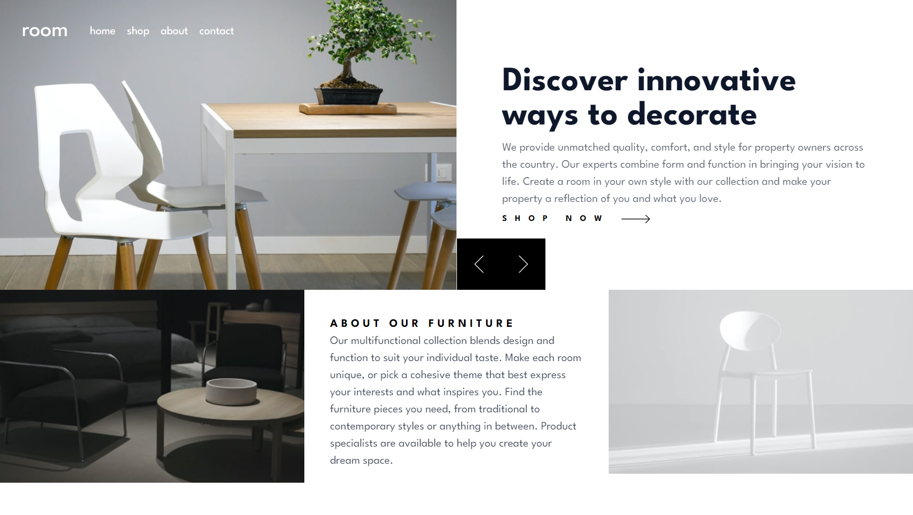
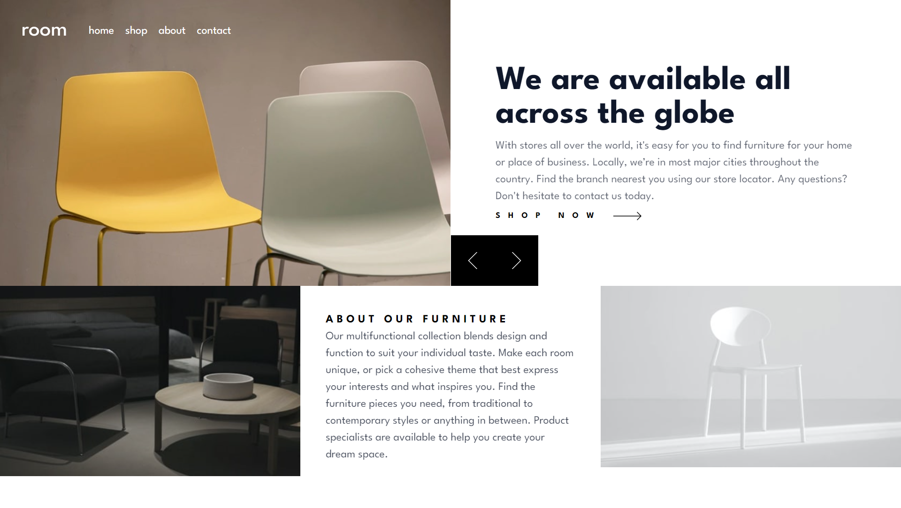
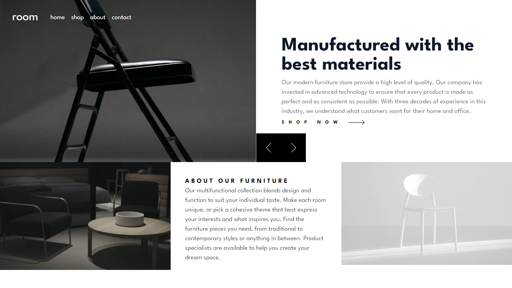
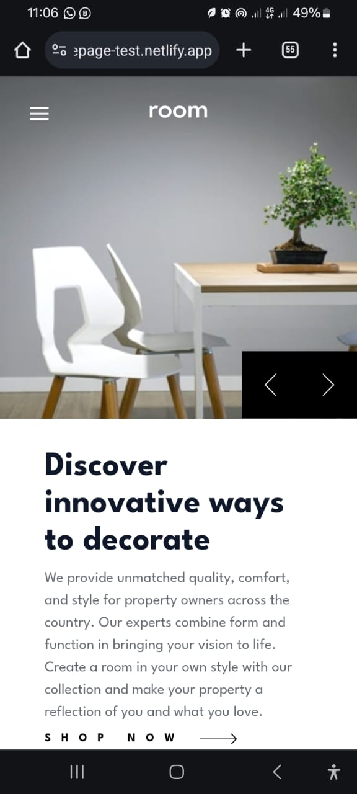
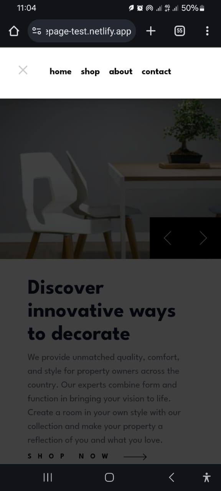

# Frontend Mentor - Room Homepage Solution

This is a solution to the [Room homepage challenge on Frontend Mentor](https://www.frontendmentor.io/challenges/room-homepage-BtdBY_ENq). Frontend Mentor challenges help you improve your coding skills by building realistic projects.

## Table of contents

- [Overview](#overview)
  - [The challenge](#the-challenge)
  - [Screenshot](#screenshot)
  - [Links](#links)
- [My process](#my-process)
  - [Built with](#built-with)
  - [What I learned](#what-i-learned)
  - [Continued development](#continued-development)
  - [Useful resources](#useful-resources)
- [Author](#author)
- [Acknowledgments](#acknowledgments)

## Overview
This project is a solution to the Room homepage challenge on Frontend Mentor. The challenge involves creating a responsive homepage for a furniture brand, incorporating features such as a slideshow and a responsive navigation menu. The project aims to provide a seamless user experience across different devices and screen sizes.
### The challenge

Users should be able to:

- View the optimal layout for the site depending on their device's screen size
- See hover states for all interactive elements on the page
- Navigate the slider using either their mouse/trackpad or keyboard

### Screenshot








### Links

- Solution URL: [GitHub Repository](https://github.com/YUSSIF62/room-homepage-test)
- Live Site URL: [Room Homepage Live](https://room-homepage-test.netlify.app/)

## My process

### Built with

- Semantic HTML5 markup
- CSS custom properties
- Flexbox
- CSS Grid
- Mobile-first workflow
- [React](https://reactjs.org/) - JS library
- [TypeScript](https://www.typescriptlang.org/) - For type safety
- [Styled Components](https://styled-components.com/) - For styles
- [Tailwind CSS](https://tailwindcss.com/) - For utility-first CSS framework
- [Netlify](https://www.netlify.com/) - For deployment

### What I learned

Working on this project allowed me to deepen my understanding of several key technologies and concepts. Here are some highlights:

#### React Components

Creating reusable and functional components in React was a significant part of this project. Here is an example of a component that manages the header with a responsive navigation menu:

```tsx
import React, { useState } from "react";
import logo from "../images/logo.svg";
import menu from "../images/icon-hamburger.svg";
import close from "../images/icon-close.svg";

const Header: React.FC = () => {
  const [isOpen, setIsOpen] = useState(false);

  return (
    <header className="absolute z-10 flex items-center justify-center w-full p-8 lg:items-center lg:justify-start">
      <div>
        
      </div>
      <div className={`${isOpen ? "bg-black bg-opacity-75 absolute top-0 left-0 right-0 bottom-0 h-screen" : "bg-transparent"} lg:bg-transparent lg:h-auto lg:relative`}>
        <nav className={`${isOpen ? "open w-full py-8 lg:py-0 lg:w-auto" : ""}`}>
          <ul className="flex flex-wrap items-center justify-center gap-4 font-bold lg:font-normal">
            <li>
              <button className="transition-all duration-200 border-b-2 border-transparent hover:border-neutral-900 lg:text-white lg:hover:border-b-white">
                home
              </button>
            </li>
            <li>
              <button className="transition-all duration-200 border-b-2 border-transparent hover:border-neutral-900 lg:text-white lg:hover:border-b-white">
                shop
              </button>
            </li>
            <li>
              <button className="transition-all duration-200 border-b-2 border-transparent hover:border-neutral-900 lg:text-white lg:hover:border-b-white">
                about
              </button>
            </li>
            <li>
              <button className="transition-all duration-200 border-b-2 border-transparent hover:border-neutral-900 lg:text-white lg:hover:border-b-white">
                contact
              </button>
            </li>
          </ul>
        </nav>
      </div>
      <div className="absolute z-20 left-8 top-8 lg:hidden">
        {isOpen ? (
          <button onClick={() => setIsOpen(false)}>
            
          </button>
        ) : (
          <button onClick={() => setIsOpen(true)}>
            
          </button>
        )}
      </div>
    </header>
  );
};

export default Header;
```

#### Responsive Design

Using CSS Grid and Flexbox allowed me to create a responsive layout that adapts to different screen sizes. Here's a snippet showing how I used CSS Grid:

```css
.section {
  display: grid;
  grid-template-columns: 1fr;
}

@media (min-width: 1024px) {
  .section {
    grid-template-columns: repeat(3, 1fr);
  }
}
```

#### State Management

Handling state in a functional React component to manage a slideshow was an interesting challenge. Here's a simplified example:

```tsx
const Showcase: React.FC = () => {
  const [slideIndex, setSlideIndex] = useState<number>(1);

  function nextSlide() {
    setSlideIndex((prevIndex) => (prevIndex !== data.length ? prevIndex + 1 : 1));
  }

  function previousSlide() {
    setSlideIndex((prevIndex) => (prevIndex !== 1 ? prevIndex - 1 : data.length));
  }

  return (
    <section>
      {data.map((item, index) => (
        <article key={item.id} className={slideIndex === index + 1 ? "grid grid-cols-1 lg:grid-cols-2 lg:place-items-center" : "hidden"}>
          
          <div className="relative p-8 lg:p-12">
            <h1 className="px-4 text-4xl font-bold text-slate-900 lg:text-5xl">{item.title}</h1>
            <p className="px-4 my-2 opacity-65 text-slate-900">{item.desc}</p>
          </div>
        </article>
      ))}
    </section>
  );
};

export default Showcase;
```

### Continued development

In future projects, I plan to:

- Further explore advanced state management techniques, such as using Redux or Context API for more complex applications.
- Improve my skills in animations and transitions to create more interactive and engaging user interfaces.
- Deepen my understanding of accessibility best practices to ensure all my projects are usable by as many people as possible.

### Useful resources

- [React Documentation](https://reactjs.org/docs/getting-started.html) - This is an excellent resource for understanding React and its ecosystem.
- [Styled Components Documentation](https://styled-components.com/docs) - This helped me a lot with styling my React components efficiently.
- [Tailwind CSS Documentation](https://tailwindcss.com/docs) - This is a comprehensive guide for using Tailwind CSS in your projects.
- [CSS Tricks](https://css-tricks.com/) - A great resource for all things CSS, including Flexbox and Grid.

## Author

- Website - [Yussif Abdul-Rahaman](https://yussifabdul-rahaman.netlify.app/)
- LinkedIn - [Yussif Abdul-Rahaman](https://www.linkedin.com/in/yussif-abdul-rahaman/)
- GitHub - [YUSSIF62](https://github.com/YUSSIF62)
- Twitter - [@YussifGomda9247](https://x.com/YussifGomda9247)

## Acknowledgments
Special thanks to anyone who reviewed my code and provided suggestions for improvements. Your insights were incredibly helpful!